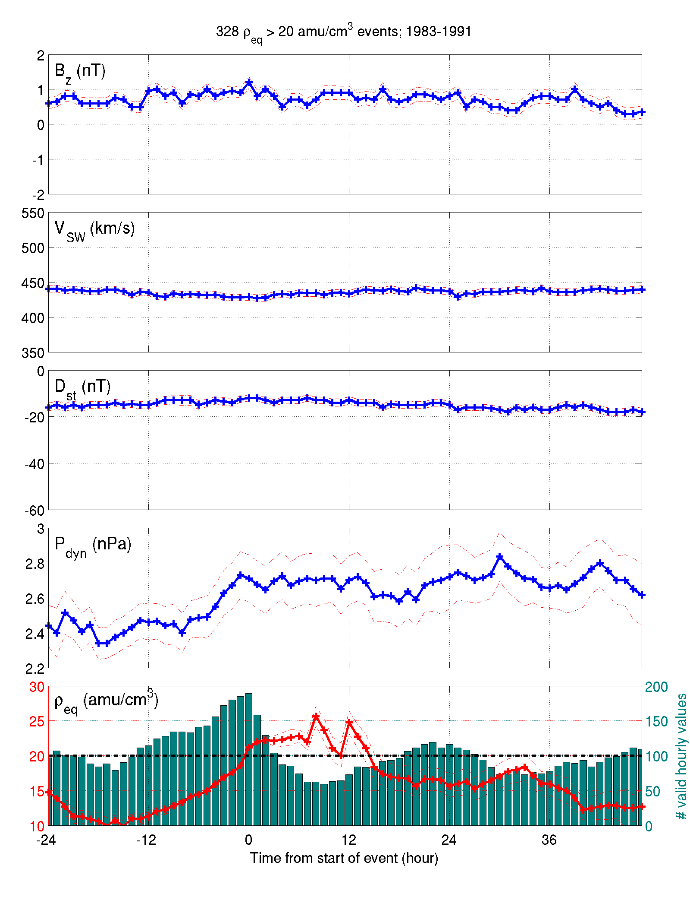

## To-Do ##
* Classify binary onset with NN model based on 3 prior days of daily averaged KP, Vsw, and F10.7 (see Denton 2016)
  * Use rho events instead of Dst events
  * Shuffle target to test effect
  * Try only 4 points before and onset, not entire dataset
  * 2D histograms of events that lead to correct "1" vs missed "1". 
* Look at -6.6R_E 
* Wilmot Hess Radiation Belt
* Makefile example and commit permissions
* Add KP to NN analysis
* Clean up figures directory
* [~~Request CDF of my run~~](#may-24-2016)
* [~~Change matlab bootstrap table output to just be inner part of table (data only)~~](#may-20-2016)
* [~~Parse Differences output data to select one point at front of magnetosphere to create timeseries for model. Bin onto 5-minute cadence.~~](#may-20-2016) [Link to CCMC results](http://ccmc.gsfc.nasa.gov/results/viewrun.php?domain=GM&runnumber=Brian_Curtis_042213_2).
* [~~Add F10.7 to binned plots~~](#may-18-2016)

## History ##
* [May 24: Binary analysis](#may-24-2016)
* [May 20: Modeling models](#may-20-2016)
* [May 18: Differences](#may-18-2016)
* [May 16: Significance tests and pressure behavior](#may-16-2016)

* * *

### May 24, 2016 ###
The CDF data for my run with real solar wind input data has been requested. For future reference, [here's the form](http://ccmc.gsfc.nasa.gov/ComQues/request_CDF.php).

I've created a few models for predicting storm onset given KP, F10.7, and Vsw, but a variety of conditions need to be tested. First was using the last 4 hours of data to predict hourly onset for the entirety of the dataset. 

Then was the same thing, but daily averages, where any days with multiple events was just classified as a single event (since the type of network used expects binary 0/1 targets)

### May 20, 2016 ###
I've created a basic program to read in Brian's output at a specific point from each time step, and make a time series out of it (just using grep on the specific x,y,and z for each file. In this case the point [10, 0, 0]R_E). Using my IR code with that and the time series inputs, I can try to correlate input variables to output variables.

In the case of Bz, nothing has any model correlation other than input Bz, and even that only has a value of 0.68 with a 3-time-lag model. Using all of the variables at once doesn't increase the correlation over just using Bz. Persistence as usual increases all correlations into the 0.95 range. Next step seems to be either a nonlinear model, or finding data for runs with more detailed input conditions (e.g. models including dst, f10.7, etc. Really just anything with an input more complex than a Bz with a sign flip).

Also fixed table to only print tabular part in matlab, so caption could be controlled by the tex file.

### May 18, 2016 ###
Trying to run the "differences" code. Compiles, but segfaults when running "make pcdiffvtk". Opens the data, interpolates, then crashes on writing output. Added mkdir -p output/Precondition/$(B)_minus_$(A) to the makefile which fixed it. That said, it still doesn't make vtk files (not sure if it's supposed to?)

"make images" fails with multiple errors of being unable to find non-specified results (e.g. Brian_Curtis_042213_1 when I only have _2 and _6), but might actually partially work if I can get the vtk files generated. Still investigating.

Also paraview file has disappeared from mag, so I'm replacing it (just kidding, don't have /var/www/tmp or sudo permissions), but might also change the link from mag to [the actual paraview website](http://www.paraview.org/paraview-downloads/download.php?submit=Download&version=v4.2&type=binary&os=linux64&downloadFile=ParaView-4.2.0-Linux-64bit.tar.gz) in the makefile.

Created [bootstrap significance table for the daily binned Dst events](tables/DeltaBootstraps-case13.txt), showing a significant difference between median value on onset day vs the day after. See figure:

Generated a very significant F10.7 bin plot showing mass density is highly dependent on F10.7 both leading up to and 24 hours after event onset for mass density > 20 amu/cm^3 events:

### May 16, 2016 ###
The significance tests are now in the paper, and I've verified the t-tests as well as I can think to. I made two test datasets, each with 10 "events" of 100 time lags each and different means. Doing a t-test of 5 events of one mean vs 5 of the other returns 100% significant results, and doing 5 of one vs 5 more of the same mean returns 2-7% significant results, as expected.  The next thing I think I'd have to test is whether the variances are significantly different since the t-test assumes equal variances. 

The figure in question is this:

Where that green dot indicates significance, and seems like it shouldn't be there. I made a histogram of the two distributions (events with larger Bz vs events with smaller Bz) at that one significant point, and they do look somewhat different (though hard to tell since I can't print figures with transparency):

It was determined that the oddities were caused by significant differences in means and medians of the data: 

This indicates that we can't use t-tests for differences in means, but must pursue bootstrapping (or some other median-based significance test such as Mann-Whitney (via ranksum function)) to determine actual levels of significance, since switching everything to means at this point would be arduous. Though these notes now probably look silly because the figures they link to now show the correct significance...

* * *

As for how Bz, Dst, and pressure behave during mass density events:

And again but with a lower mass density threshhold for events:

Can also look at the binned figures, but only a couple show any significant features:

* Bz binned by Dst

* Bz binned by F10.7

* Dst binned by F10.7

* Mass Density binned by F10.7

Pressure doesn't seem to have much effect, though I also haven't looked at all possible binning combinations yet.

