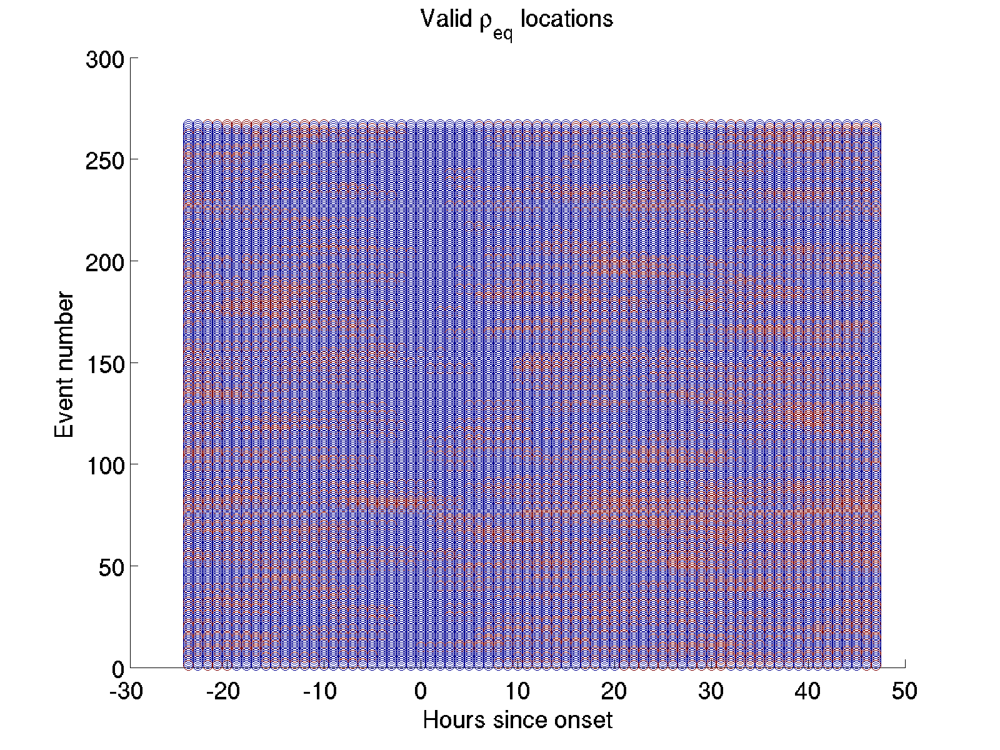
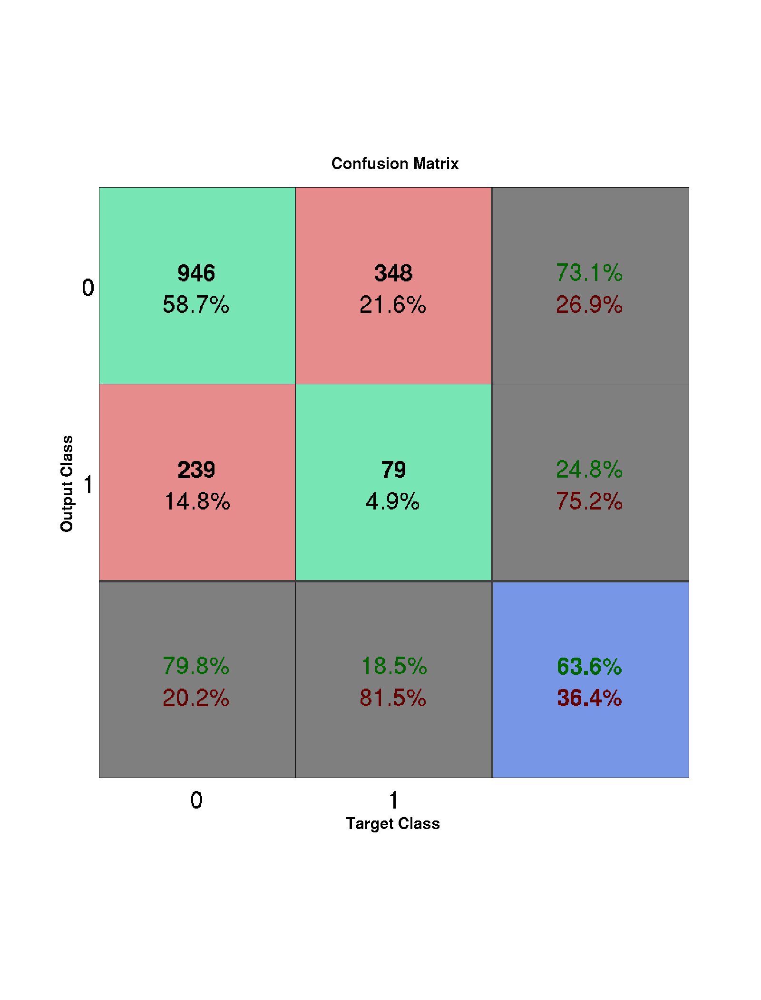
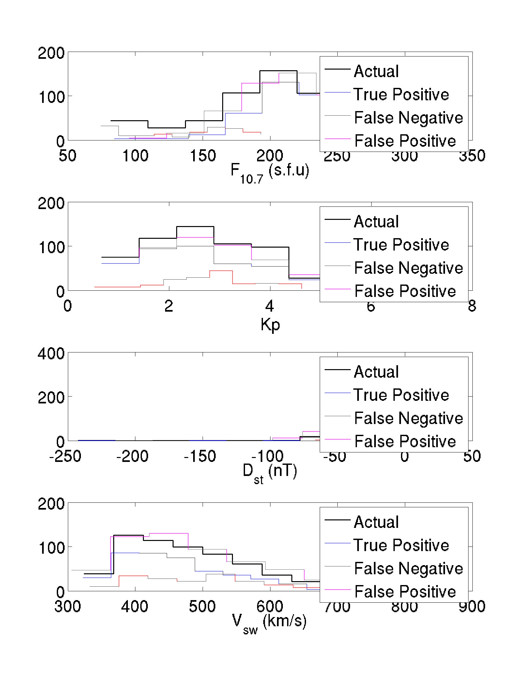
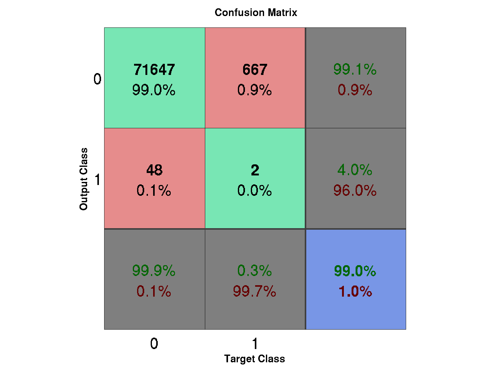
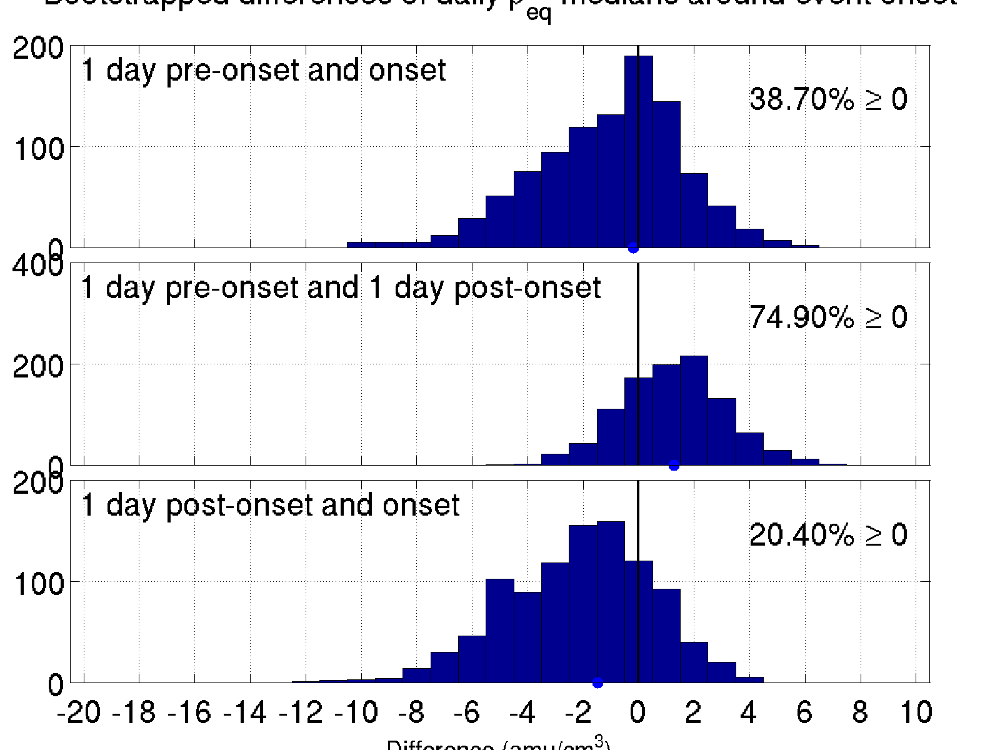

## To-Do ##
* ~~Connect Denton 2016 to Ch5~~
* ~~Add plasmasphere knee details (pass location, etc)~~
* ~~show MLT dependence not significant~~
* Make new run without dipole tilt, using only real B field, at high resolution
* Histograms for models of entire time series, include rho and possibly Bz
* Correlation plots of pv^2, vBz
* ~~Classify binary onset with NN model based on 3 prior days of daily averaged KP, Vsw, and F10.7 (see Denton 2016)~~
  * ~~Use rho events instead of Dst events~~
  * ~~Shuffle target to test effect~~
  * ~~Try only 4 points before and onset, not entire dataset~~
  * ~~2D histograms of events that lead to correct "1" vs missed "1". ~~
* ~~Wilmot Hess Radiation Belt~~
* Makefile example and commit permissions
* Add KP to NN analysis
* ~~Clean up figures directory~~
* ~~Epoch analysis for 668 random events, daily and hourly~~
* ~~Remake figure 3.2 for GOES 6, show alongside~~
* ~~cite MATLAB libraries~~
* ~~Include Tak plot in 4.4~~
* ~~Make stack plots take entire page~~
* ~~4.4 Epoch analysis~~
* ~~Find last-late-add date and thesis submission date (Jul 29)~~
* ~~Write up confusion matrix section after finishing chapter 3~~
* [~~Look at -6.6R_E~~](#may-24-2016) 
* [~~Request CDF of my run~~](#may-24-2016)
* [~~Change matlab bootstrap table output to just be inner part of table (data only)~~](#may-20-2016)
* [~~Parse Differences output data to select one point at front of magnetosphere to create timeseries for model. Bin onto 5-minute cadence.~~](#may-20-2016) [Link to CCMC results](http://ccmc.gsfc.nasa.gov/results/viewrun.php?domain=GM&runnumber=Brian_Curtis_042213_2).
* [~~Add F10.7 to binned plots~~](#may-18-2016)

## History ##
* [September 5: Paper edits](#september-5-2016)
* [August 17: Other variables](#august-17-2016)
* [July 7: RhoBinned all satellites](#july-7-2016)
* [June 1: Correlation Plots](#june-1-2016)
* [May 24: Binary analysis](#may-24-2016)
* [May 20: Modeling models](#may-20-2016)
* [May 18: Differences](#may-18-2016)
* [May 16: Significance tests and pressure behavior](#may-16-2016)

* * *
### September 5, 2016 ###
First plot just to show where all the storms are relative to F10.7 values:

Significance values for the GOES 7 version of the Takahashi verification plot:

And that takahashi plot for reference:

A figure where each variable is only using the rows with existing rho_eq values.

F10.7 Binplot only using existing rho_eq values

F10.7 of events that have existing rho_eq at onset:

rho_eq availability map:

### August 17, 2016 ###
For Dst < -50nT events (case 1), GOES 6
##### V_SW #####
 

##### P_Dyn #####

 

##### Kp #####

 

### July 7, 2016 ###
6:
 

2:
 

5:
 

7:
 

### June 1, 2016 ###
Made 2D correlation plots of MHD model vs IR model of model (need better term). This is using the prior 3 data points (equal to an hour and a half), and all available input variables. Unsurprisingly, correlation is great at the edges far from earth. More surprisingly, there are sections of very high correlation along the shock boundaries. Example plot for Bz:

This process works similarly well for By:

But loses some effectiveness for Bx:

To investigate further, a scatter plot of correlation vs the average value of that variable across all cuts was made (e.g. the correlation for the Bz model at [x=10 R_E, z=0 R_E] vs the mean of Bz at that point for each time step would make one plot point). This was done to see if there were any trends that would account for higher or lower correlations. It doesn't appear that there's much of significance, though this plot could use a lot of work since the scale is so hard to get to show anything useful (tried logs, sqrts, quantiles, all have one issue or another. Currently showing quantiles to avoid the large discontinuity values messing up the axis)

  

This was also done for the pressure and density terms to similar effect:

 

##### NN #####
Also looked at was another form of the neural net models. This time, instead of using all time data to attempt to predict, the model just uses onset (with a target value of 1) and the three hours before onset (with target values of 0). It also looks at mass density events rather than dst events. This method entirely fails for hourly values by not predicting any events at all:

But still correctly picks up about 1/3 of the events on a daily average:

And fails to predict any onsets when the onsets are shuffled (but still keeping the 4-day blocks together):

In an attempt to discern what values led to correctly predicting events vs failing to predict events, histograms were made of the conditions associated with true positives and false negatives:

Where it can be seen that true positives only show up for higher values of F10.7, lower values of Kp, and about average values of Vsw. 

### May 24, 2016 ###
The CDF data for my run with real solar wind input data has been requested. For future reference, [here's the form](http://ccmc.gsfc.nasa.gov/ComQues/request_CDF.php).

Running [my CCMC run](http://ccmc.gsfc.nasa.gov/results/viewrun.php?domain=GM&runnumber=Victoir_Veibell_041316_1) with real solar wind data through Brian's code returns interesting results. Still using a 3-coefficient IR model at the point [10 0 0], the correlations between model Bz and predicted Bz based on impulse variables are as follows:

| Var | CC |
| --- | --- |
| Bx | 0.00 |
| By | 0.21 |
| Bz | 0.55 |
| Vx | 0.50 |
| Vy | 0.00 |
| Vz | 0.00 | 
| N | 0.13 | 
| T | 0.50 |
| All | 0.83 |

Interesting that temperature has such a high correlation, and that combining all variables contributes enough independent information to raise the correlation from around 0.5 to 0.8. Running it again at the point [-6.5 0 0], on the night side of earth, changes correlations like so:

| Var | CC |
| --- | --- |
| Bx | 0.00 |
| By | 0.44 |
| Bz | 0.11 |
| Vx | 0.36 |
| Vy | 0.00 |
| Vz | 0.00 | 
| N | 0.25 | 
| T | 0.19 |
| All | 0.67 |

On a hunch that correlation got better the closer to the boundaries you got (since that's where, I assume, the input conditions are applied), I tested the point [30 0 0] and got:

| Var | CC |
| --- | --- |
| Bx | 0.00 |
| By | 0.43 |
| Bz | 0.63 |
| Vx | 0.10 |
| Vy | 0.00 |
| Vz | 0.00 | 
| N | 0.19 | 
| T | 0.32 |
| All | 0.75 |

so the magnetic field correlates well there, but everything else gets worse. The magnetic field is also less variable there since there's no bowshock that far forward, possibly making the model simpler, but this doesn't explain why the overall correlation is better right inside the magnetopause.

Just outside the magnetopause [14.5 0 0] the "All" correlation drops to 0.575, and seems to mostly come from Bz. Next step, plot correlations against x position.

I've created a few models for predicting storm onset given KP, F10.7, and Vsw, but a variety of conditions need to be tested. First was using the last 4 hours of data to predict hourly onset for the entirety of the dataset. 

Then was the same thing, but daily averages, where any days with multiple events was just classified as a single event (since the type of network used expects binary 0/1 targets)

### May 20, 2016 ###
I've created a basic program to read in Brian's output at a specific point from each time step, and make a time series out of it (just using grep on the specific x,y,and z for each file. In this case the point [10, 0, 0]R_E). Using my IR code with that and the time series inputs, I can try to correlate input variables to output variables.

In the case of Bz, nothing has any model correlation other than input Bz, and even that only has a value of 0.68 with a 3-time-lag model. Using all of the variables at once doesn't increase the correlation over just using Bz. Persistence as usual increases all correlations into the 0.95 range. Next step seems to be either a nonlinear model, or finding data for runs with more detailed input conditions (e.g. models including dst, f10.7, etc. Really just anything with an input more complex than a Bz with a sign flip).

Also fixed table to only print tabular part in matlab, so caption could be controlled by the tex file.

### May 18, 2016 ###
Trying to run the "differences" code. Compiles, but segfaults when running "make pcdiffvtk". Opens the data, interpolates, then crashes on writing output. Added mkdir -p output/Precondition/$(B)_minus_$(A) to the makefile which fixed it. That said, it still doesn't make vtk files (not sure if it's supposed to?)

"make images" fails with multiple errors of being unable to find non-specified results (e.g. Brian_Curtis_042213_1 when I only have _2 and _6), but might actually partially work if I can get the vtk files generated. Still investigating.

Also paraview file has disappeared from mag, so I'm replacing it (just kidding, don't have /var/www/tmp or sudo permissions), but might also change the link from mag to [the actual paraview website](http://www.paraview.org/paraview-downloads/download.php?submit=Download&version=v4.2&type=binary&os=linux64&downloadFile=ParaView-4.2.0-Linux-64bit.tar.gz) in the makefile.

Created [bootstrap significance table for the daily binned Dst events](tables/DeltaBootstraps-case13.txt), showing a significant difference between median value on onset day vs the day after. See figure:

Generated a very significant F10.7 bin plot showing mass density is highly dependent on F10.7 both leading up to and 24 hours after event onset for mass density > 20 amu/cm^3 events:

### May 16, 2016 ###
The significance tests are now in the paper, and I've verified the t-tests as well as I can think to. I made two test datasets, each with 10 "events" of 100 time lags each and different means. Doing a t-test of 5 events of one mean vs 5 of the other returns 100% significant results, and doing 5 of one vs 5 more of the same mean returns 2-7% significant results, as expected.  The next thing I think I'd have to test is whether the variances are significantly different since the t-test assumes equal variances. 

The figure in question is this:

Where that green dot indicates significance, and seems like it shouldn't be there. I made a histogram of the two distributions (events with larger Bz vs events with smaller Bz) at that one significant point, and they do look somewhat different (though hard to tell since I can't print figures with transparency):

It was determined that the oddities were caused by significant differences in means and medians of the data: 

This indicates that we can't use t-tests for differences in means, but must pursue bootstrapping (or some other median-based significance test such as Mann-Whitney (via ranksum function)) to determine actual levels of significance, since switching everything to means at this point would be arduous. Though these notes now probably look silly because the figures they link to now show the correct significance...

* * *

As for how Bz, Dst, and pressure behave during mass density events:

And again but with a lower mass density threshhold for events:

Can also look at the binned figures, but only a couple show any significant features:

* Bz binned by Dst

* Bz binned by F10.7

* Dst binned by F10.7

* Mass Density binned by F10.7

Pressure doesn't seem to have much effect, though I also haven't looked at all possible binning combinations yet.

